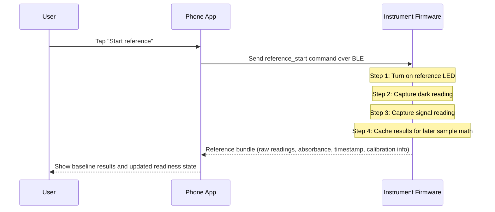
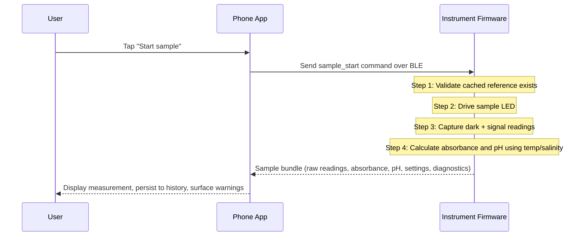
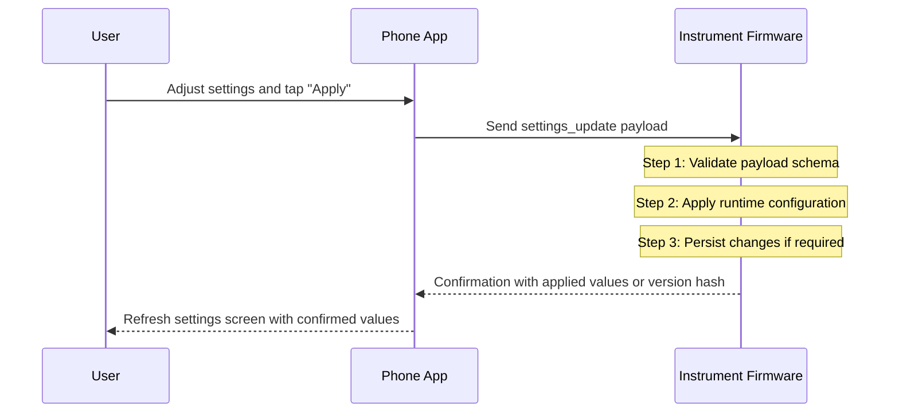
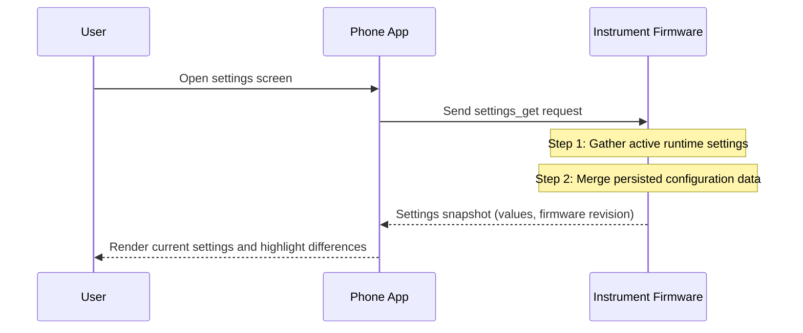
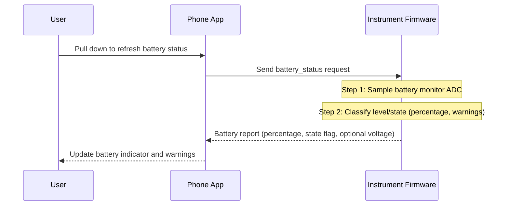
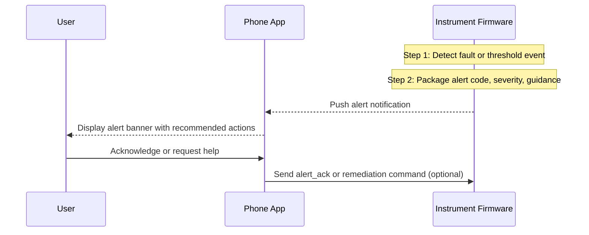
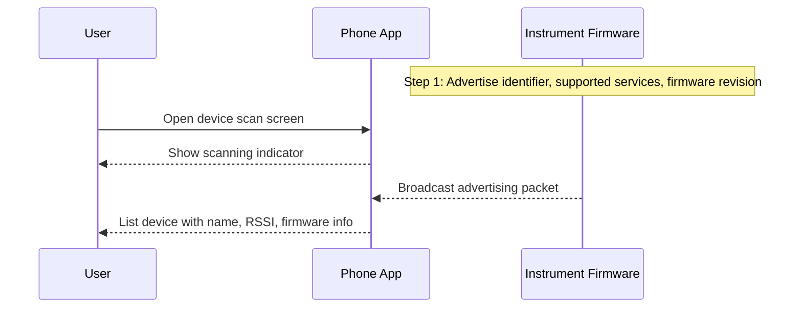
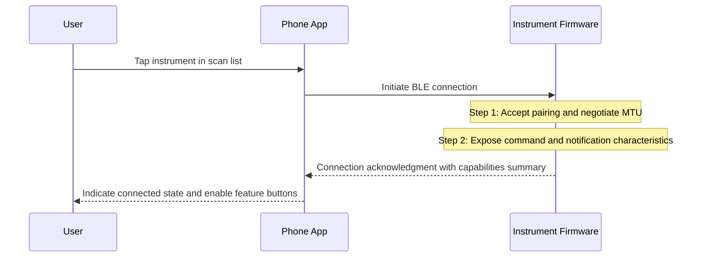
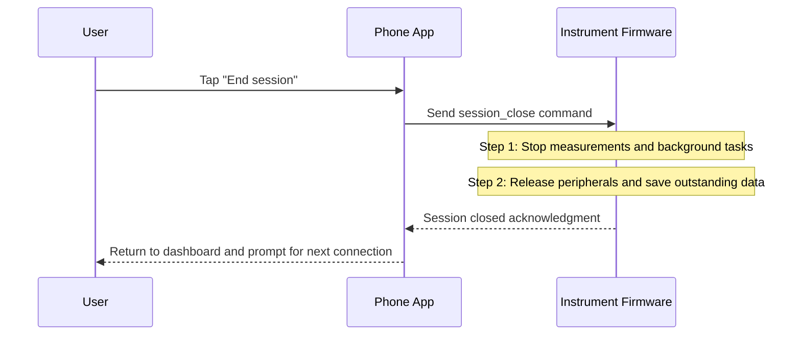

# Phone ↔ Instrument Interaction Diagrams

This document visualizes how key features in the feature backlog play out between a user, the phone app, and the instrument firmware.

## Quick Reference

| Feature | Diagram Section | Summary |
| --- | --- | --- |
| Reference measurement | [Reference Measurement](#reference-measurement) | User triggers a reference; instrument captures baseline readings. |
| Sample measurement | [Sample Measurement](#sample-measurement) | User runs a sample after a reference; instrument returns pH and context. |
| Settings update | [Settings Update](#settings-update) | User edits settings; instrument applies and confirms the change. |
| Settings refresh | [Settings Refresh](#settings-refresh) | User requests current settings; instrument reports live values. |
| Battery status | [Battery Status](#battery-status) | User checks battery; instrument samples and reports capacity. |
| Alert propagation | [Alert Propagation](#alert-propagation) | Instrument pushes an alert; user sees remediation guidance. |
| BLE availability | [BLE Availability](#ble-availability) | User scans for devices; instrument advertises presence. |
| BLE connection | [BLE Connection](#ble-connection) | User connects; instrument negotiates GATT services. |
| Session teardown | [Session Teardown](#session-teardown) | User ends the session; instrument shuts down activity and confirms. |

## Reference Measurement

## Sample Measurement

## Settings Update

## Settings Refresh

## Battery Status

## Alert Propagation

## BLE Availability

## BLE Connection

## Session Teardown

